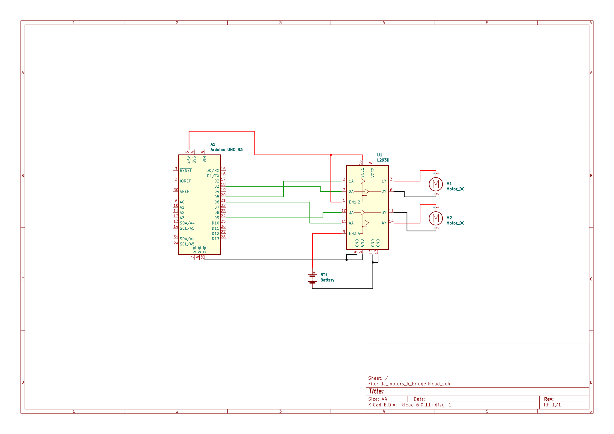

#### A simple way to control dc motors connected to an arduino with a slider-like gesture, through the opencv and mediapipe libraries in python.

#### Circuit:

#### Credit:
- <ins>Sanyu Projects World (Hand Gesture Control Guide)</ins>: https://www.youtube.com/watch?v=nPzde1YG4ko
